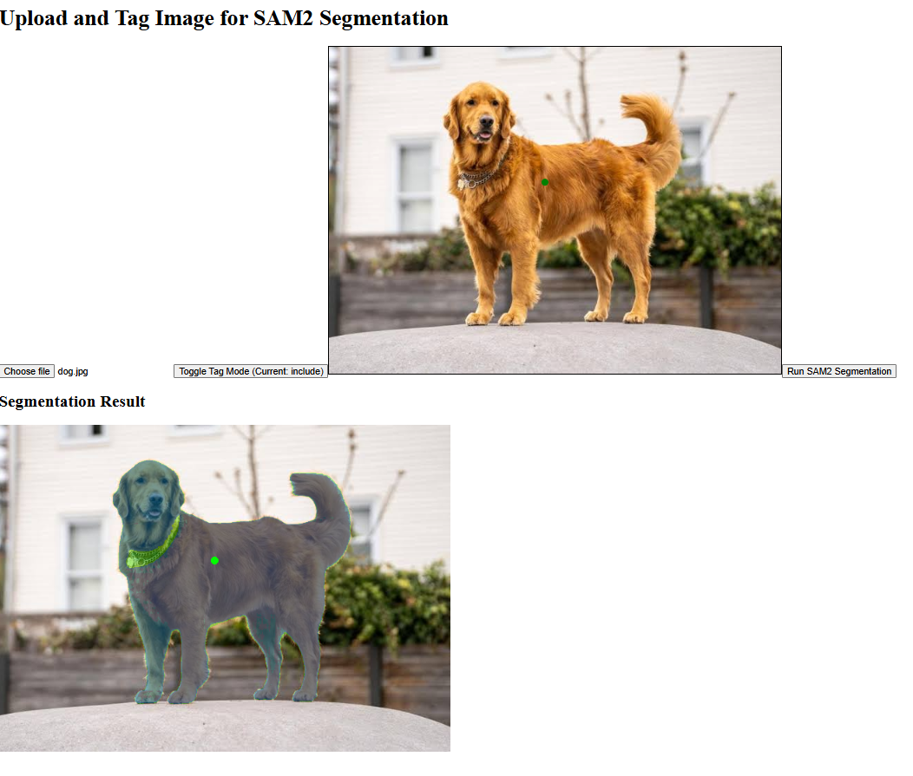
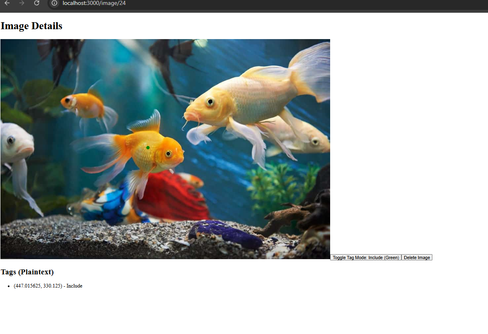

This project is a website where you upload a picture with tags. 
The picture and tags are processed by Meta's SAM2 AI and returns the image
a mask indicating different objects.

This project was created with DJango, Next.js, and SAM2

Installation:
Download project
$ pip install -r requirements.txt
Download and setup SAM2
In recog/services/sam2_model.py change:
checkpoint and
model_cfg
to your install of SAM2

/upload for image upload and recognition
/image/# to delete and update images in the database

